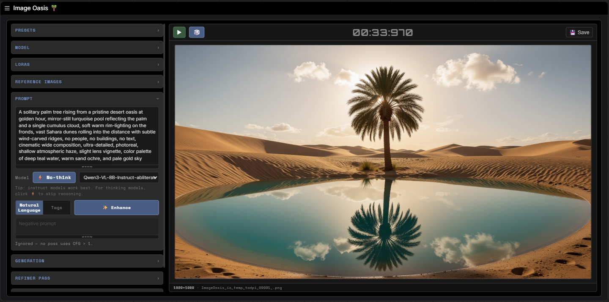
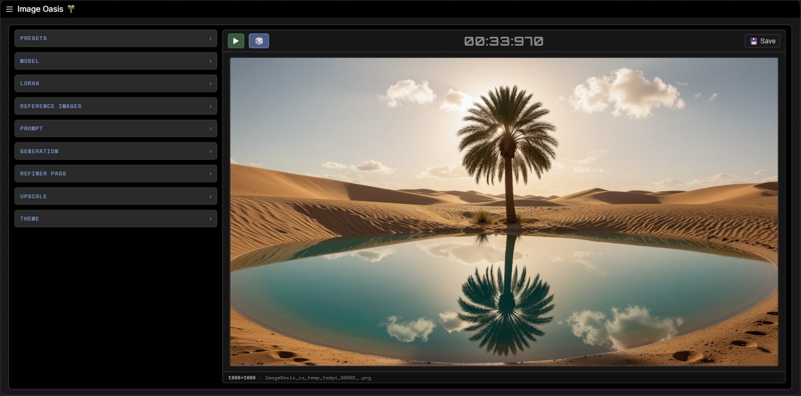

# Image Oasis 🌴

A standalone, all-in-one ComfyUI image generation node. One node replaces the
multi-Switch graph: pick an architecture, point at a model, prompt, get a
finished image — with an optional prompt enhancer, refiner pass, and upscale.



Every section collapses individually, so the node stays compact when you're
not adjusting it:



## What it does in one node
- **Tri-source model loading**: checkpoint / diffusion (unet) / GGUF
- **Architecture switching** via a dropdown (a capability *registry* replaces
  every "Switch (Any)" node): Flux, Qwen-Image-Edit, SD3, AuraFlow, Other
- **Architecture-correct model-sampling patch** (ModelSamplingFlux /
  DiscreteFlow with the right multiplier), with arch-default shift values
- **LoRA stack**: any number of LoRAs applied to model + CLIP in order, each with
  its own model/CLIP strength — works over GGUF UNets as well as safetensors
- **Conditioning** that branches automatically: plain CLIP text encode, or
  TextEncodeQwenImageEditPlus with up to 3 reference images (upload *or*
  drag-and-drop) when the architecture supports it
- **VAE-derived empty latent** (correct channel count / compression per model)
- **Refiner pass (img2img-style)**: optional second sampling pass over the base
  result. The base runs to full denoise, then the refiner re-noises to
  `refiner_denoise` strength and runs its own steps — the "second KSampler at
  partial denoise" pattern, independent of the base schedule
- **Optional upscale**: algorithmic or spandrel model upscale with OOM-fallback
  tiling
- **Prompt enhancer ("magic wand")**: expand a short prompt into a detailed one
  with a local LLM — see below
- **Presets**: save and reload named configurations
- **On-node output**: the generated image renders in the node's right-hand pane,
  with a save-to-output button and a randomize-seed-and-generate dice on the
  output header (always available, so you can iterate without keeping the
  Generation group open)

## LoRA stack

The Model section has a **LoRAs** subsection where you can stack any number of
LoRAs. Each row is a LoRA file (from `ComfyUI/models/loras/`) plus a **model**
strength and a **CLIP** strength; "+ Add LoRA" adds rows and the ✕ removes them.
LoRAs are applied **in list order, top to bottom**, to both the model and CLIP
right after the model loads and before the sampling patch — so if two LoRAs
fight, reorder them rather than only lowering strengths.

- **Strength tweaks are cheap.** The loader caches the raw on-disk model
  separately from the LoRA-patched layer, so changing a strength re-patches from
  the cached base instead of re-reading the model from disk. Only changing the
  model file itself triggers a full reload.
- **GGUF is supported.** LoRAs apply over GGUF-quantized UNets. The patched
  layers give back some of the quantization's memory saving (expected, not a
  bug), so VRAM ticks up slightly with a heavy stack.
- **The stack rides along in presets.** Saving a preset captures the LoRA list
  and strengths as part of the reusable "look".

## Reference images

The **Reference Images** section holds up to three slots, used by image-edit
architectures (e.g. Qwen-Image-Edit) and ignored by the rest. Fill a slot two
ways: click **Upload**, or **drag an image straight onto the slot** — from your
file manager, from another browser tab, or even from the node's own output pane
to iterate on a result. Dropped images are copied into ComfyUI's input folder
exactly like uploads, so they behave identically downstream.

## Prompt enhancer (magic wand)

The Prompt section has a "magic wand" that expands a short prompt into a rich,
detailed one using a local GGUF LLM. It is **out-of-band**: it is not part of the
generation graph. Clicking Enhance loads the LLM, rewrites the prompt, writes the
result back into the positive box, and unloads — all before you ever queue an
image. Because it loads and unloads per click, it never competes with the
diffusion model for VRAM during sampling.

Controls: a **model dropdown**, a **Think / No-think** toggle, and an **NL / Tags**
style toggle. "Natural Language" produces a flowing paragraph (best for Flux,
Qwen-Image-Edit, SD3); "Tags" produces comma-separated positive tags (best for
SDXL-style models). The result is **reversible** — a revert button restores your
original typed prompt, and it always reverts to the text you wrote, not to a
previous enhancement.

### No-think toggle (for hybrid thinking models)
The 💭 Think / ⚡ No-think button next to the model dropdown lets you run hybrid
reasoning models in fast non-thinking mode. When active, the enhancer:

- prefixes `/no_think` to the user message (the Qwen3 soft-switch), and
- passes `chat_template_kwargs={"enable_thinking": False}` to llama-cpp-python
  when that version supports it (probed automatically at runtime).

Together these tell the model's chat template to inject an empty
`<think></think>` block so the model skips its reasoning step. When it works,
the speedup is large — typically 4-5× faster on a Q5-Q8 quant of stock
Qwen3-8B in our testing.

**Which models actually honor it.** This part matters: the toggle is only
meaningful on a *narrow* set of models. In practice:

- **Stock Qwen3 GGUFs (8B, 14B, 32B) with hybrid mode intact**: the toggle
  works as designed. Big speedup, no quality loss for rewrite-style tasks like
  prompt enhancement.
- **Most community fine-tunes and merges (Hivemind, abliterated variants, MoE
  builds, etc.)**: thinking has typically been stripped or template-defaulted-off
  during the fine-tune. The model never thinks in either mode, and the toggle
  is a no-op. The model still works — it just behaves like a regular instruct
  model regardless of toggle state.
- **Qwen3.5 / Qwen3.6**: thinking is always on, and the `/no_think` soft-switch
  was removed. The proper `enable_thinking=False` path *should* work via
  `chat_template_kwargs`, but only on a current `llama-cpp-python`. The 0.3.20
  release (and earlier) doesn't forward the kwarg; in that case there is
  currently no way to disable thinking on Qwen3.5+ and the model will always
  run slowly. Upgrade `llama-cpp-python` to fix this (see Optional
  dependencies — note the wheel-availability caveat for bleeding-edge
  Python/CUDA combinations).

**Quick check.** To confirm whether your specific GGUF is a true hybrid build,
run an enhance with Think on and watch the console — if the model emits an
explicit `<think>...</think>` block, hybrid mode is intact and the toggle will
help. If the output goes straight to `[OUTPUT]` (or emits plain-text "Thinking
Process:" prose without the tags), the toggle has nothing to disable on that
model.

### Enhancer setup
1. Install `llama-cpp-python` (see Optional dependencies below).
2. Put a GGUF LLM in `ComfyUI/models/LLM/`. It appears in the model dropdown.
3. Select it, pick a style, click Enhance.

The enhancer auto-sizes GPU offload from the GGUF header and live free VRAM: it
puts as many layers on the GPU as fit (with a safety reserve), falls back to a
partial or CPU-only load otherwise, and retries on CPU if a GPU load OOMs. You do
not configure layers or context — it is handled.

### Recommended enhancer model
Use an **abliterated, instruct-tuned Qwen3** GGUF — available in 4B, 8B, 14B,
and 32B — at the highest size + quant that fully fits your VRAM (for ~8 GB
cards, 8B Q4_K_M is a good sweet spot; more VRAM, go bigger or higher quant;
under 8 GB, the 4B is a clean fallback). Why each part matters:

- **Abliterated / uncensored**: a stock instruct model will sanitize, soften, or
  refuse certain subjects *regardless of the system prompt*. If enhancements come
  back euphemized or watered down, the model is the cause, not the prompt — use
  an abliterated build.
- **Instruct, not "thinking"/reasoning**: instruct models follow the formatting
  rules cleanly. Thinking models burn most of their output budget on reasoning,
  which makes enhancement slow and can occasionally leak that reasoning into the
  prompt box. If you do want to use a thinking model, click the ⚡ No-think
  toggle (see above) — Qwen3-family models behave like instruct models in that
  mode, and the speed difference is dramatic. The enhancer also extracts the
  final answer from `[OUTPUT]` tags as a backstop, so leaked reasoning is rare
  even with thinking on.
- **VL is fine for text**: the enhancer only sends text, never images, so a
  vision-language model's vision tower goes unused. That is harmless — Qwen's own
  benchmarks put VL text quality on par with the pure-text models — and the VL
  abliterated builds are the well-maintained ones. A text-only Qwen3-8B
  abliterated GGUF works identically and saves the unused vision weight if you
  prefer it.
- **Why version 3**: Qwen3 has clean instruct builds and works well here; 3.5 has
  no instruct variant (reintroducing the thinking-leak problem), and there is no
  reason to drop back to 2.5.

> Tip: enhancer output targets ~900 characters. Z-Image Turbo and Qwen-Image-Edit
> begin losing prompt accuracy past roughly 1000 characters (the text encoder
> truncates or dilutes), so the enhancer aims just under that ceiling.

## Install
```bash
cd ComfyUI/custom_nodes
git clone https://github.com/NikoDemon80/ComfyUI-Image-Oasis
cd ComfyUI-Image-Oasis
pip install -r requirements.txt
```
Restart ComfyUI. The node appears under **Image Oasis → Image Oasis**.

> Alternatively, download the repo as a zip, extract into
> `ComfyUI/custom_nodes/`, and run `pip install -r requirements.txt` from
> inside the extracted folder.

### What `requirements.txt` installs
- **`spandrel`** + **`spandrel-extra-arches`** — model-based upscaling
  (the Upscale section's "Model" mode). Algorithmic upscaling needs nothing.

### Optional dependencies (not in `requirements.txt`)
Image Oasis works without these — each missing dep just disables its specific
feature with a clear error at use-time, not at node-load.

- **`ComfyUI-GGUF`** — a separate ComfyUI custom node (not a pip package),
  required for the GGUF source type and GGUF CLIP files. Install via ComfyUI
  Manager or:
  ```bash
  cd ComfyUI/custom_nodes
  git clone https://github.com/city96/ComfyUI-GGUF
  ```
  Without it, checkpoint and diffusion source types still work; selecting GGUF
  errors clearly.

- **`llama-cpp-python`** — local LLM runtime for the prompt enhancer
  ("magic wand"). Kept out of `requirements.txt` because the CUDA install is
  toolkit-specific.

  **Pre-built wheels (easiest)**:
  ```
  pip install llama-cpp-python                          # CPU only
  pip install llama-cpp-python --extra-index-url https://abetlen.github.io/llama-cpp-python/whl/cu124   # CUDA 12.4 prebuilt
  ```
  PyPI's stock wheel is CPU-only. The abetlen wheel index has CUDA-built wheels
  per Python+CUDA combination — check
  [abetlen.github.io/llama-cpp-python](https://abetlen.github.io/llama-cpp-python/)
  for the URL matching your toolkit (cu121 / cu122 / cu124 / etc.).

  **Source build with CUDA (when no prebuilt wheel exists for your combo)**:
  ```
  set CMAKE_ARGS=-DGGML_CUDA=on
  set FORCE_CMAKE=1
  pip install --upgrade --force-reinstall --no-cache-dir llama-cpp-python
  ```
  This compiles from source — expect 15-30 minutes on a modern CPU. It requires:
    - **Visual Studio Build Tools** with the *Desktop development with C++*
      workload (provides `cl.exe`). Free from Microsoft.
    - **CMake** on PATH (3.21 or newer).
    - **CUDA Toolkit** matching your driver (headers, libs, and `nvcc`).
      Install from NVIDIA.

  On Linux, swap `set` for `export` and the rest is identical. On macOS, replace
  `-DGGML_CUDA=on` with `-DGGML_METAL=on` for Apple Silicon GPU acceleration.

  **Heads up — bleeding-edge Python / CUDA**: if you're on a very new Python
  (3.13+) or CUDA toolkit (13+), pre-built wheels may not exist yet. `pip install`
  will silently fall back to a CPU-only source build *without* the CUDA flags
  unless you set them explicitly. If your enhancer is suddenly slow after an
  upgrade, check that the install built with CUDA — the build log near the end
  should mention `GGML_CUDA` being enabled.

## Notes
- Leave `clip_type` and `shift` neutral (blank / 0) to use the architecture's
  defaults from the registry.
- Adding a new architecture later = one new entry in `registry.py`.

## Credits
- Execution timer (Orbitron readout + queue-event pattern) adapted from
  crt-nodes.
